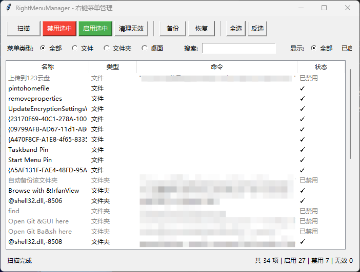

<h1 align="center">📋 RightMenuManager</h1>

<p align="center"><b>一款轻量的 Windows 右键菜单管理工具，帮助你清理和管理传统右键菜单中的菜单项。</b></p>

<p align="center">
  
  
  
</p>

---

## 功能亮点

- **扫描菜单项** — 扫描文件、文件夹、桌面的右键菜单，显示每个菜单项的来源
- **禁用/启用** — 一键禁用不需要的菜单项（不删除，安全可恢复）
- **清理无效项** — 自动检测并禁用无效/残留的菜单项
- **备份/恢复** — 导出当前配置，万一搞错了能一键还原
- **搜索筛选** — 按名称搜索，按类型/状态筛选

## 界面预览

<p align="center">
  
</p>

## 快速开始

### 方式一：下载 EXE（推荐）

前往 [Releases](https://github.com/qiuyuehu/RightMenuManager/releases) 页面，下载最新版本的 `RightMenuManager.exe`，右键以管理员身份运行。

### 方式二：命令行运行

```bash
# 1. 克隆仓库
git clone https://github.com/qiuyuehu/RightMenuManager.git
cd RightMenuManager

# 2. 运行（需要管理员权限）
python main.py
```

### 方式三：双击启动

双击 `start.bat`，会自动请求管理员权限并启动程序。

## 使用说明

### 基本操作

1. **扫描** — 点击"扫描"按钮，程序会自动扫描所有右键菜单项
2. **禁用** — 选中要禁用的菜单项，点击"应用更改"
3. **启用** — 选中已禁用的菜单项，点击"应用更改"（会切换状态）
4. **清理** — 点击"清理无效"，自动禁用所有无效菜单项

### 筛选和搜索

- **菜单类型** — 选择只显示文件/文件夹/桌面的菜单项
- **显示状态** — 选择只显示已启用/已禁用的菜单项
- **搜索** — 输入关键词，实时筛选

### 备份和恢复

- **备份** — 点击"备份"，选择保存位置，导出当前配置
- **恢复** — 点击"恢复"，选择备份文件，一键恢复

### 注意事项

- **需要管理员权限** — 修改注册表需要管理员权限，程序会自动请求
- **不删除菜单项** — 只是禁用（隐藏），不删除，安全可恢复
- **自动备份** — 每次修改前会自动备份到 `~/.RightMenuManager/backups/`
- **双击查看** — 双击菜单项可以打开注册表编辑器查看详细信息

## 系统要求

- **操作系统**：Windows 10 / 11
- **Python**：3.7 及以上（打包后不需要）
- **权限**：管理员权限

## 项目结构

```
RightMenuManager/
├── main.py          # 程序入口
├── core.py          # 注册表扫描和操作引擎
├── gui.py           # 界面
├── PLAN.md          # 项目规划文档
├── start.bat        # 一键启动脚本
├── LICENSE          # MIT 开源协议
└── README.md        # 项目说明
```

## 常见问题

**Q：为什么需要管理员权限？**
A：修改 Windows 注册表需要管理员权限，这是系统安全机制。

**Q：禁用的菜单项还能恢复吗？**
A：可以。程序只是在注册表中添加了"LegacyDisable"标记，选中后点击"应用更改"即可恢复。

**Q：会不会损坏系统？**
A：不会。程序只禁用菜单项，不删除任何数据。而且每次修改前会自动备份，万一出问题可以恢复。

**Q：杀毒软件报毒怎么办？**
A：这是 Python 打包的常见误报。代码完全开源，可自行审计后添加白名单。

## 更新日志

### v1.0.0（2026-05-27）

- 🎉 初始发布
- ✨ 扫描文件/文件夹/桌面右键菜单
- ✨ 禁用/启用菜单项
- ✨ 清理无效菜单项
- ✨ 备份/恢复功能
- ✨ 搜索和筛选

## 作者

**qiuyuehu** — [GitHub](https://github.com/qiuyuehu)

**衾衾 (Hermes Agent)** — 开发与设计

## License

[MIT](LICENSE)

---

<p align="center">
  如果觉得有用，点个 ⭐ Star 支持一下吧！
</p>